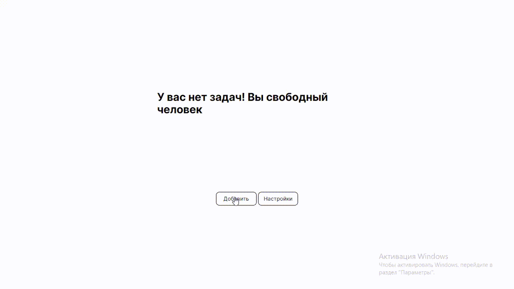
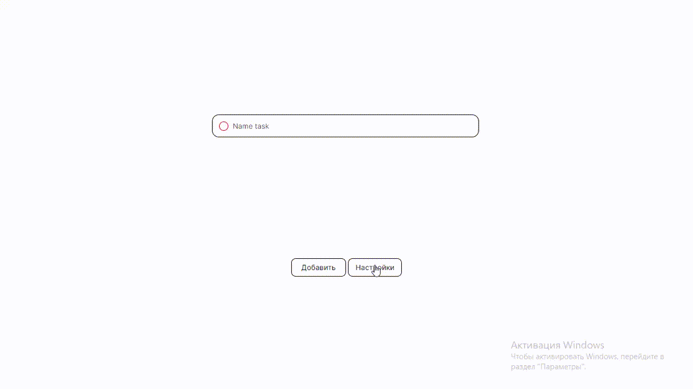

# Table of contents

* [ToDo list (ru)](#todo-list-ru)
* [ToDo list (en)](#todo-list-en)
  
# ToDo list (ru)

## Вступление
Привет! Перед тобой мой небольшой простенький проект - список задач (ToDo list), благодаря которому можно составить список своих дел/рабочих задач/ежедневных рутин. Данный проект не имеет достаточно богатого функционала, поэтому, если есть желание добавить пару незаменимых фич в проект, ты знаешь, что делать (только перед этим прочти все нижележащее: стиль кода, файловая архитектура и т.п.).

К сожалению, я не могу приложить демо-версию, так как Github не предназначен для этого (нужно арендовать сервер, добавить базу данных, переписать backend для взаимодействия с этой базой данных). Однако, я приложил пару gif-файлов для обзора.


Обзор фукнционала по работе с задачами в приложении


Обзор фукнционала настроек пользователя в приложении

## Основная часть
В данном разделе можно ознакомиться с технической стороной проекта. Основные технические аспекты проекта:

### Стек технологий
Данный проект написан с помощью:

Frontend:
* библиотека [React](https://react.dev/) + [React Router](https://reactrouter.com/en/main)
* менеджера состояния [Redux Toolkit](https://redux-toolkit.js.org/introduction/getting-started)
* [TypeScript](https://www.typescriptlang.org/)
* unit-тестрование на [Jest](https://jestjs.io/) + [React testing library](https://testing-library.com/docs/react-testing-library/intro/)
* транспилятор [Babel](https://babeljs.io/)
* сборщик проекта [Webpack](https://webpack.js.org/)
* сервер для разработки frontend - [Webpack dev server](https://webpack.js.org/configuration/dev-server/)

Backend:
* фреймворк [Express](https://expressjs.com/ru/)
* [NodeJS](https://nodejs.org/)
* [JSDOC](https://jsdoc.app/)

### Как запустить проект
Для того чтобы запустить проект, вам потребуется установить npm-пакеты библиотек. Для того чтобы это сделать вам потребуется установить на ПК [NodeJS](https://nodejs.org/ru/download) в месте с которым идет [npm](https://docs.npmjs.com/cli/v8/commands/npm) (пакетный менеджер) для скачивания пакетов из облачного сервера npm.

После этого перейдите через консоль в корневую директорию проекта, которая содержит frontend и backend директории. Далее из корневой директории перейдите в директорию frontend и установите необходимые пакеты:
```txt
npm install
```
Запустите Webpack сервер и ждите пока откроется окно браузера:
```txt
npm run serve
```
Для запуска тестирования frontend:
```txt
npm run test
```
Затем перейдите в директорию backend. Установите npm-пакеты:
```txt
npm install
```
Запустите сервер Express:
```txt
npm run start
```
  
### Файловая архитектура
При написании проекта старался придерживаться [Feature-Sliced Design архитектуры](https://feature-sliced.design/docs/get-started/overview).

## Заключение
По завршению данного проекта получше ознакомился с библиотекой React + React Router и веб-фреймворком Express. Также впервные протестировал свой код с помощью фреймворка Jest, так как ранее тестировал код самописной библиотекой (см. мой предыдущий проект [speedTyping](https://github.com/Gleb001/speedTyping/tree/main)).


# ToDo list (en)
## Introduction
Hi! Here is my little simple project - ToDo list, thanks to which you can make a list of your to-do/work tasks /daily routines. This project does not have a sufficiently rich functionality, so if you want to add a couple of irreplaceable features to the project, you know what to do (just before that read everything below: code style, file architecture, etc.).

Unfortunately, I can't attach a demo version, since Github is not designed for this (you need to rent a server, add a database, rewrite the backend to interact with this database). However, I have attached a couple of gif files for review.


Overview of the functionality for working with tasks in the application


Overview of the functionality of user settings in the application

## The main part
In this section, you can get acquainted with the technical side of the project. Main technical aspects of the project:

### Technology stack
This project is written using:

Frontend:
* [React](https://react.dev/) + [React Router](https://reactrouter.com/en/main) libraries
* [Redux Toolkit](https://redux-toolkit.js.org/introduction/getting-started) status manager
* [TypeScript](https://www.typescriptlang.org/)
* unit testing on [Jest](https://jestjs.io/) + [React testing library](https://testing-library.com/docs/react-testing-library/intro/)
* transpilator [Babel](https://babeljs.io/)
* [Webpack](https://webpack.js.org/) project builder
* frontend development server - [Webpack dev server](https://webpack.js.org/configuration/dev-server/)

Backend:
* framework [Express](https://expressjs.com/ru/)
* [NodeJS](https://nodejs.org/)
* [JSDOC](https://jsdoc.app/)

### How to launch a project
In order to be patient, you need to install the library's npm packages. In order to do something, you need to register on a PC [NodeJS](https://nodejs.org/ru/download ) in the place I'm going with [npm](https://docs.npmjs.com/cli/v8/commands/npm ) (batch manager) for downloading packages from any npm server.

After that, go through the console to the root directory of the project, which supports the interface and server directories. More from the root directory, go to the directory interface and install optional packages:
``` txt
npm install
```
Download the server web package and wait for it to open for viewing:
```txt
npm run serve
```
To run frontend testing:
```txt
npm run test
```
Then go to the backend directory. Install the npm packages:
```txt
npm install
```
Start the Express Server:
```txt
npm run start
```

### File architecture
When writing the project, I tried to adhere to the [Feature-Sliced Design architecture](https://feature-sliced.design/docs/get-started/overview ).

## Conclusion
Upon completion of this project, I got better acquainted with the React + React Router library and the Express web framework. I also tested my code for the first time using the Jest framework, as I had previously tested the code with a self-written library (see my previous project [speedTyping](https://github.com/Gleb001/speedTyping/tree/main )).
